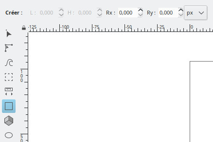
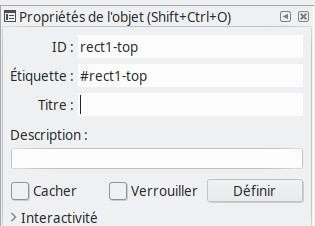
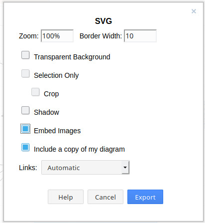

# SVG

## Build an SVG file

### Background

The background image is an integral part of the plugin.

It is made possible to make it dynamic. To do so, the background image must be in the vectorized format [SVG](https://fr.wikipedia.org/wiki/Scalable_Vector_Graphics)

## Editor

### Inkscape

The recommended software to make a background image will be [Inkscape](https://inkscape.org). It is available for :

- Linux
- Windows
- Mac

#### The properties

When starting the software, you must determine the dimensions of the document, which will be used as the initialization space. To do this, the numerical unit of measurement defined will be the pixel (px).

This parameter is accessed from the properties menu.

> It is not necessary to create a background plan of the space you have just created.

#### The shapes

Inkscape offers a simplified interface. It allows you to add and create shapes and objects in the previously defined properties, which are :

- Circle
- Square
- Links
- Other...

Each object created, must have an identifier (ID) that will be made available for the **Weathermap** plugin.

To add an identifier to a graphical form, you need to `right click` on your object, then go to `Properties of the object`. A window will appear allowing you to modify the identifier.

#### Backup

You must save your creation in **SVG simple** or **SVG Inkscape** format which can be loaded in the plugin display, with the SVG extension.

#### Demo

You can consult the associated [tutorial 4](../demo/tutorial04.md) for the creation of a SVG file.

the file will be saved as **Simple SVG** or **SVG Inkscape**.

### Draw.io

The [Draw.io](https://draw.io/) editor is accessible from a browser.

The Community version offers a wide choice of graphic objects already ready for use.

The activation of the shapes we are interested in, are the shapes libraries `networking` which will facilitate visuals of your network.

You must export the image in SVG format.

The mandatory parameters to be checked are `embed images`.

## Backup

It is important that each element must have an `ID` key so that the created file can be imported into the plugin.

> Warning:
> you must not save in flat format, nor compress the file
