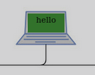
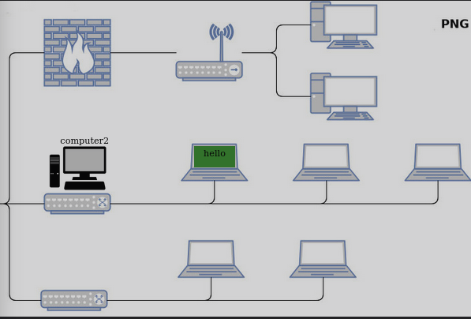

# Add PNG/JPG in your dashboard

[](README.md)

## Add an image as a display

For this tutorial, you will first download the picture background :


Adding a background image is done from the `display` menu.

The selected image will be [demo02-background.jpg](../../resource/demo02-background.jpg).

To do this, we download it in base64 with the `Copy image address` function, or with the direct link to the repository:

```
https://raw.githubusercontent.com/atosorigin/grafana-weathermap-panel/master/docs/resource/demo02-background.jpg
```

It is possible to have more details with the [display](../editor/display.md) page.

## Define a coordinate mode region with image

### Add an image in a region

The creation of a region in an SVG image is done from the `Coordinates space`, `region`, and `Add coordinate space` menu.


You have to fill out the form like this:

- Enter a `label` for example New Computer
- Select `Coordinate mode`.
- Then choose an image

To finish

- Click on the `save` button

The selected image will be [cumputer-png.png](../../resource/computer-png.png). To do this, we download it in base64 with the `Copy image address` function.

```
https://raw.githubusercontent.com/atosorigin/grafana-weathermap-panel/master/docs/resource/computer-png.png
```

Then choose the size of the region for your image. Here we choose :

- X Min : -55
- X Max : -80
- Y Min : -30
- Y Max : 15


### Result

The end result will be like this:


## Define a coordinate mode region without image

### Step 1 : Create the region

The creation of a region in an SVG image is done from the `Coordinates space`, `region`, and `Add coordinate space` menu.


You have to fill out the form like this:

- Enter a `label` for example New Computer
- Select `Coordinate mode`.


Then choose the size of the region for your image. Here we choose :

- X Min : -18
- X Max : 0
- Y Min : -5
- Y Max : 8

To finish

- Click on the `save` button

### Step 2 : Add color to a region


Adding a color to an SVG element is done from the `Coordinates space`, `region`, and `Edit coordinate space` menu.

You select the `Lower limit' line and then complete the form like this:

- Enable `Trace the background` to activate the background color.
- Select the `green` color in the `Edit background color` line.

You get the following result



It is possible to define other parameters, referring to the [coordinates lower limit](../editor/coordinates-lower-limit.md) page.

### Result

The end result will be like this:



## Define an oriented link between two regions

To create an oriented link you have to pass by [the panel menu](../panel/panel-oriented-link.md).

## Final Result


### Import JSON file

- It is possible to add all of those configurations through JSON files by doing an import. To know how to do it, [follow this link](../editor/import.md)

And here is the different JSON file :

- [demo02-CoorRegion](../../resource/demo02-CoorRegion.json)
- [demo02-link](../../resource/demo02-link.json)
