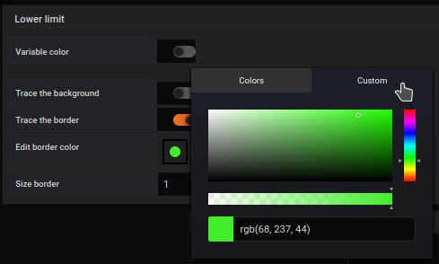
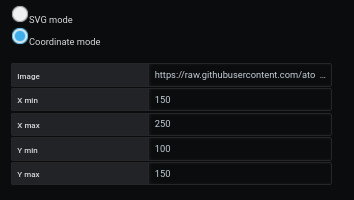
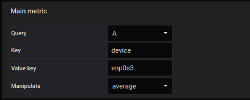
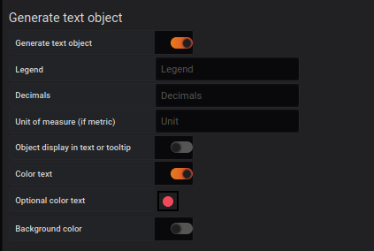
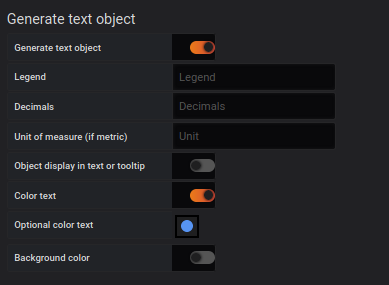
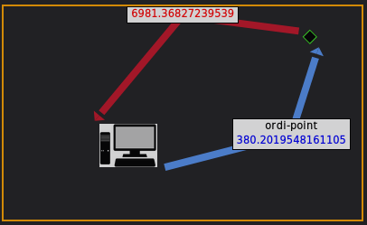

A corriger

# Create an advanced dashboard with directional links

[](README.md)

## Step 1: Creating queries

The first step is through the `Queries` tab.

You must:

- Complete the line `metrics` with the following line

```
rate(node_network_receive_bytes_total{device="ens3"}[10s])

rate(node_network_transmit_bytes_total{device="ens3"}[10s])
```

The "A" and "B" markers will be used to identify this query as you can see below.


## Step 2: Determining a space


The creation of a background space is done from the `display' menu.

It requires

- Uncheck `use svg`
- Enter the width
- Enter height

## Step 3: Add a point 1


The creation of a point is done from the `Coordinates space`, `point` and `Add point` menu.

You have to fill out the form like this:

- Enter a `label' for example Computer
- The `size`
- The `shape`
- position `X`
- position `Y`



We take advantage of this by changing the color of our point. To do this, we add color to our point like this:

- Enable `trace the border`
- Let's choose the color as `green` to the line `edit border color` and customize a shade of our chosen color.
- Size border at 1

## Step 4 : Add an image

To add an illustration to our region, go to `Coordinates space`, `region`, and `Add coordinate space` menu. And choose our point.


You have to fill out the form like this:

- Enter a `label` for example New Computer
- Select `Coordinate mode`.
- Then choose an image

The selected image will be [computer-png.png](../../resource/computer-png.png). To do this, fill the input with the adresse of the svg file

```
https://raw.githubusercontent.com/atosorigin/grafana-weathermap-panel/master/docs/resource/computer-png.png
```

Then chosse the size of the region for your image. Here we choose :

- X Min : 100
- X Max : 250
- Y Min : 100
- Y Max : 150



## Step 5 : Define incurved oriented links

For this step, we will define 2 incurved oriented links. The first one, from the point to the pictures and the second one, from the picture to the point.

First let's create 2 oriented links.

To create an oriented link you have to pass by [the panel menu](../panel/panel-incurved-link.md).

Then, we will edit our links as follow :


## Step 6 : Main metric

To add the main metric to our link, go to `Coordinates space`, `OrientedLink` and click on your link.

Then in `Main metric`, choose your metric for the first link.



And choose the other metric for the second link


## Etape 7 : Text object

The customization of metric values is done from the **Generate text object** form, go to `Coordinates space`, `OrientedLink` and click on your link.

Then, in `Text object`, you need to check the `Generate text object` checkbox and fill this in:

- check `color text`.
- choose a colour: for example Red



Et choisissez l'autre métrique pour le deuxième lien avec

- check `color text`.
- choose a colour: for example blue



Optionally, you can remove the label from the link as shown in the result

## Resultat



### Import JSON file

- It is possible to add all of those configurations through JSON files by doing an import. To know how to do it, [follow this link](../editor/import.md)

And here is the different JSON file :

- [demo3-region](../../resource/demo03-region.json)
- [demo3-point](../../resource/demo03-point.json)
- [demo3-link](../../resource/demo03-link.json)
