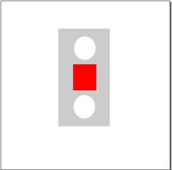

# How to create and add your own SVG image in Grafana

 
 
## Create you SVG on Inkscape

### Properties of the space

From the Inkscape software, we defined the properties of our space in pixels with the values  : 

  - width : 400 px
  - height : 400 px

You can also see more information about SVG image creation [here](../appendix/svg.md)

### Étape 2 : Create your shape

We create several geometric shapes from the Inskcape software, which are : 

  - 2 squares
  - 2 circles

### Step 3 : Add id to all of your objects

It is necessary to add an id to all of your objects. It will be easier to use with Grafana.

To add an id, `right click` on your object, then go on `Properties of your object`. A window will appears and will allow you to change the ID

### Step 4 : Save you shape

To save your shape, you need to save in `SVG Inkscape` or `SVG simple` format.

## Add your SVG in Grafana

Adding a background image is done from the `display` menu.

The image you just created will be uploaded from your computer. To do this, you click on `browse` in the upload image line, which you will find [here](../../resource/demo04-background.svg)

It is possible to have more details with the [display](../editor/display.md) page.

Then, if you want to add a region, from the menu `Coordinates space`, `region` and `Add region`. You can see the different id of your shape in `Zone SVG`. 

