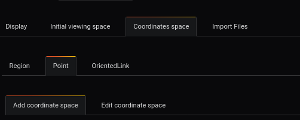
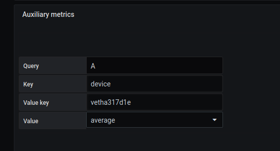

# How to use auxiliere metric

[](README.md)

## Add a dashboard SVG


Adding a background image is done from the `display` menu.

The selected image will be [demo01-background.svg](../../resource/demo01-background.svg).

To do this, we download it in base64 with the `Copy image address` function, or with the direct link to the repository:

```
https://raw.githubusercontent.com/atosorigin/grafana-weathermap-panel/master/docs/resource/demo01-background.svg

```

It is possible to have more details with the [display](../editor/display.md) page.

You have to save and reload the page.

## Add an auxiliary metric to a point

### Step 1: Add a point



- To place a point, go to `Visualization`, then `Coordinates space`, `Point`, and `Add coordinate space`.


You have to fill out the form like this:

- Fill in the "label" of the point
- Inform his " size".
- Enter the X and Y position where you want the point to appear.

### Step 2 : Add main metric


The first step is through the `Queries` tab.

You must:

- Complete the line `metrics` with the following line

```
rate(node_network_transmit_bytes_total[5m])
```

The "A" marker will be used to identify this query as you can see below.

Once you have done that, you will associate this query to your point


The second step is from the `Coordinates space`, `region`, and `Edit coordinate space` menu of the `visualization` tab.

You select the `Main metric` line to complete the form like this:

- Enter a `Query` for example A
- Click on the `load` button

The value will be automatically displayed after the page is refreshed.

It is possible to fill in the other fields with the additional settings available on the page [coordinates space region](../editor/coordinates-space-region.md)

### Step 3 : Add auxiliary metric

Go to `Auxiliary metrics` and fill the form like `Main metric`



After that, you will be able to see your auxiliary metric on the toolbox of your point


### Import JSON file

- It is possible to add all of those configurations through JSON files by doing an import. To know how to do it, [follow this link](../editor/import.md)

And here is the JSON file :

[demo8-point](../../resource/demo08-point.json)
