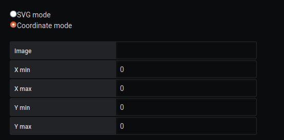
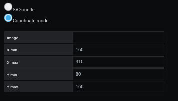
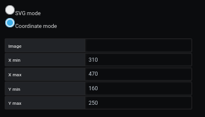

# How to create a coordinate mode region

[](README.md)

## Add a dashboard SVG


Adding a background image is done from the `display` menu.

The selected image will be [demo01-background.svg](../../resource/demo01-background.svg).

To do this, we download it in base64 with the `Copy image address` function, or with the direct link to the repository:

```
https://raw.githubusercontent.com/atosorigin/grafana-weathermap-panel/master/docs/resource/demo01-background.svg

```

It is possible to have more details with the [display](../editor/display.md) page.

You have to save and reload the page.

## Add region with coordinate mode

In this section we will explain how to create different regions on the dashboard with the coordinate mode.



Here, we can see a section with `X min`,`X max`,`Y min`,`Y max`.
t
The reference point is the point (0,0). So we can have 3 different case

For a<b,

- If Xmin and Xmax are negative :

  - Xmin = b
  - Xmax = a
  - Exemple :
    - `a=-60` and `b=-20`.
    - So `Xmin=-20` and `Xmax=-60`

- If Xmin is negative Xmax is positive :

  - Xmin = a
  - Xmax = b
  - Exemple :
    - `a=-20` and `b=20`.
    - So `Xmin=-20` and `Xmax=20`

- If Xmin and Xmax are positive :
  - Xmin = a
  - Xmax = b
  - Exemple :
    - `a=20` and `b=60`.
    - So `Xmin=20` and `Xmax=60`

Let's create these three regions on the dashboard.
Let's take the same values as X for Y
So we will have the following data :

Region 1



Region 2



Region3


## Add color to our regions

We will add different colors to our regions to differentiate them. Go the the `LowerLimit` and enable `Trace the border`. Then choose a color and a size for the border


## Result

Once you've done this for your three regions, you should have something like this :


### Import JSON file

- It is possible to add all of those configurations through JSON files by doing an import. To know how to do it, [follow this link](../editor/import.md)

And here is the JSON file :

[demo09-region](../../resource/demo09-region.json)
