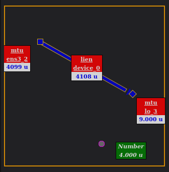

# Gabarit

[](README.md)

## Add the queries

The example shows how to use query filters to obtain precise metrics


In a query, we want to analyze what the network card receives

Query refID A

```
node_network_name_assign_type

```

The result shows several possible outcomes

```
node_network_name_assign_type{device="ens3",instance="localhost:9100",job="node_exporter"}

```

and the Query RefID B

```
node_network_flags
```

The result shows several possible outcomes

```
node_network_flags{device="ens3",instance="localhost:9100",job="node_exporter"}
node_network_flags{device="lo",instance="localhost:9100",job="node_exporter"}

```

to get a number at the moment, you have to tick the **instant** box for each query

To associate refined query elements to a template, we will focus on the :

- device

which will be used in the json template file in the list **filtered**

## Step 2: Determining a space


The creation of a background space is done from the `display' menu.

It requires

- Uncheck `use svg`
- Enter the width (ex : 400)
- Enter height (ex : 400)

It is possible to have more details with the [display](../editor/display.md) page.

## Gabarit

In the **Gabarit** tab


vous ajoutez le fichier par défaut

```
https://raw.githubusercontent.com/atosorigin/grafana-weathermap-panel/master/docs/resource/demo14-default.json

```

puis 1 clic que le bouton **Add**


you add the link to the json file

```
https://raw.githubusercontent.com/atosorigin/grafana-weathermap-panel/master/docs/resource/demo13-point.json

```

then 1 click that the button **Add** followed by **finish**

```
https://raw.githubusercontent.com/atosorigin/grafana-weathermap-panel/master/docs/resource/demo13-point-link.json

```

then 1 click that the button **Add** followed by **finish**

the link will be displayed in the second part of the screen


he must be given a query for

- A for the first file
- B for the second file

## Temporary part (but currently the operation is necessary)


You must go to the **point** tab of **Coordinate space**.


In **Text Object** you uncheck the line **Object display in text or tooltip**.

## Result



You will see a dot appear and all the settings will be available in the editor.
