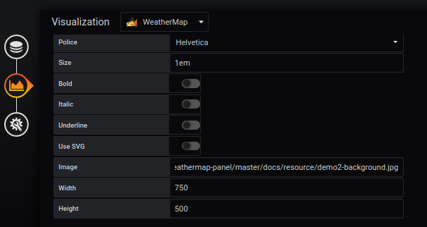
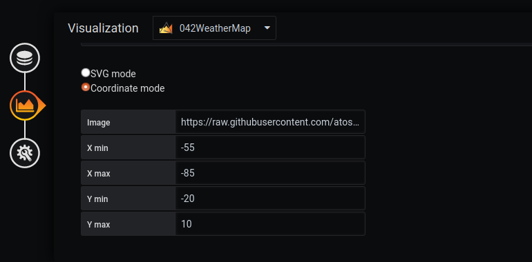
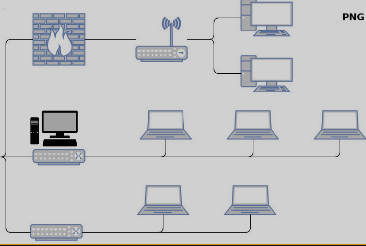
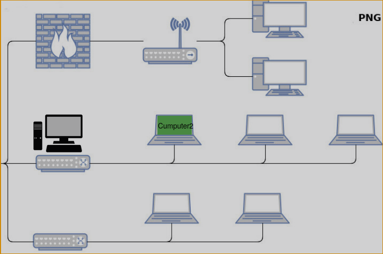

# Add PNG/JPG in your dashboard

## Add an image as display
For this tutorial, you will first download the picture background : 

Adding a background image is done from the `display` menu.

The selected image will be [demo2-background.jpg](../../resource/demo2-background.jpg). To do this, we download it in base64 with the `Copy image address` function.

It is possible to have more details with the [display](../editor/display.md) page.

You have to save and reload the page.

## Define an coorinate mode region with image

### Add an image in a region

The creation of a region in an SVG image is done from the `Coordinates space`, `region` and `Add coordinate space` menu.

You have to fill out the form like this: 

- Enter a `label` for example New Computer
- Select `Coordinate mode`.
- Then choose an image

The selected image will be [cumputer-png.png](../../resource/computer-png.png). To do this, we download it in base64 with the `Copy image address` function.

Then chosse the size of the region for your image. Here we choose :
- X Min : -55
- X Max : -85 
- Y Min : -20
- Y Max : 10

To finish
- Click on the `load` button

### Result

The end result will be like this: 

## Define an coorinate mode region without image

### Step 1 :Create the region

The creation of a region in an SVG image is done from the `Coordinates space`, `region` and `Add coordinate space` menu.

You have to fill out the form like this: 

- Enter a `label` for example New Computer
- Select `Coordinate mode`.

Then chosse the size of the region for your image. Here we choose :
- X Min : -18
- X Max : 0
- Y Min : -6
- Y Max : 9

To finish
- Click on the `load` button

### Step 2 : Add a color to a region

Adding a color to a SVG element is done from the `Coordinates space`, `region` and `Edit coordinate space` menu.

You select the `Lower limit' line and then complete the form like this: 
 

- Enable `Trace the background` to activate the background color. 
- Select the `green` color in the `Edit background color` line.
- Enable `Trace the border` to activate the border color.
- Select the `red` color in the `Edit border color` line.
- Enter a value to set the size of the border `size border` for example 3
- Click on the "load" button

You get the following result

It is possible to define other parameters, referring to the [coordinates lower limit](../editor/coordinates-lower-limit.md) page.

### Result

The end result will be like this: 

## Define an oriented link between two regions

To create an oriented link you have to pass by [the panel menu](../panel/panel-oriented-link.md).

## Final Result 

## Add everything with JSON

### Import JSON file

- It is possible to add all of those configuration through json files by doing an import. To know how to do it, [follow this link](../editor/import.md)

And here is the different JSON file :

- [demo2-svgRegion](../../resource/demo2-svgRegion.json) 
- [demo2-point](../../resource/demo2-point.json)
- [demo2-link](../../resource/demo2-link.json)
- [demo2-global](../../resource/demo2-global.json)

