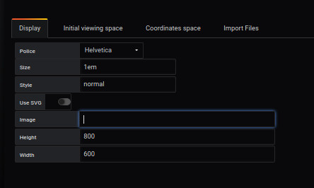
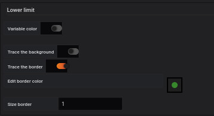
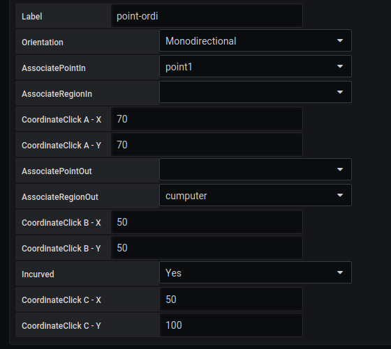
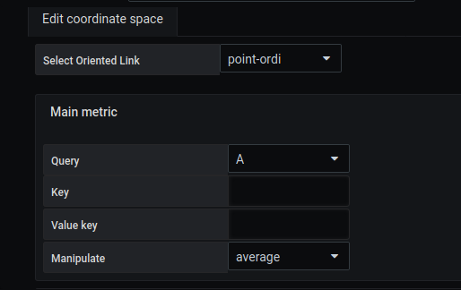
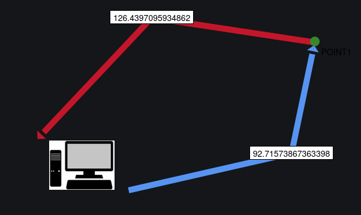

# Create Dashboard Avanced with link  directionnel


## Step 1: Creating queries


The first step is through the `Queries` tab.

You must:

- Complete the line `metrics` with the following line

```
rate(node_network_receive_bytes{device="enp0s3"}[10s])*8/1024/1024

rate(node_network_transmit_bytes{device="enp0s3"}[10s])*8/1024/1024
```

The "A" and "B" markers will be used to identify this query as you can see below.


## Step 2: Determining a space





The creation of a background space is done from the `display' menu.

It requires 

- Uncheck `use svg`
- Enter the width
- Enter height


## Step 3: Add a point 1


The creation of a point is done from the `Coordinates space`, `point` and `Add point` menu.

You have to fill out the form like this: 

- Enter a `label' for example Computer
- The `size` 
- position `X`
- position `Y`
- Click on the "load" button




We take advantage of this by changing the colour of our point. To do this, we add a color to our point like this: 

- Enable `trace the color`
- Let's choose the color as `green` to the line `edit border color`.
- Thickness at 1


## Step 4 : Add an image 


To add an illustraton to our region, go to `Coordinates space`, `region` and `Add coordinate space` menu. And choose our point.


You have to fill out the form like this: 

- Enter a `label` for example New Computer
- Select `Coordinate mode`.
- Then choose an image


The selected image will be [cumputer-svg.svg](../../resource/computer-svg.svg). To do this, fill the input with the adresse of the svg file

Then chosse the size of the region for your image. Here we choose :
- X Min : -10
- X Max : -50
- Y Min : -10
- Y Max : -50

To finish
- Click on the `load` button


## Step 5 : Define incurved oriented links

For this step, we will define 2 incurved oriented links. The first one, from the point to the pictures and the second one, from the picture to the point.

First let's create 2 oriented links.

To create an oriented link you have to pass by [the panel menu](../panel/panel-incurved-link.md).

Then, we will edit our links as follow :



## Step 6 : Main metric

To add a main metric to our link, go to `Coordinates space`, `OrientedLink` and click on you link.

Then in `Main metric`, choose you metric.



And 


## Resultat





### Import JSON file

- It is possible to add all of those configuration through json files by doing an import. To know how to do it, [follow this link](../editor/import.md)

And here is the different JSON file :

- [demo3-region](../../resource/demo3-region.json) 
- [demo3-point](../../resource/demo3-point.json)
- [demo3-link](../../resource/demo3-link.json)

