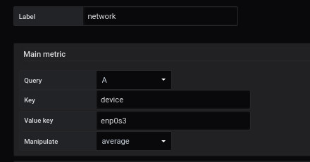

 
# create file modelisation

l'exemple montre comment utiliser les filtres des query pour obtenir des metrics précises


Dans une query, nous voulons analyser ce que reçoit la carte réseau


```
node_network_receive_bytes

```


le résultat montre plusieurs résultats possibles


```
node_network_receive_bytes{device="enp0s3",instance="localhost:9100",job="node_exporter"}

node_network_receive_bytes{device="lo",instance="localhost:9100",job="node_exporter"}

```

La différence montre 2 types de devices 

- enp0s3
- lo


Il faut associer 1 metrics par region ou points...

comme ceci


Region 1




Region 2


Le resultat affiche 2 valeurs


