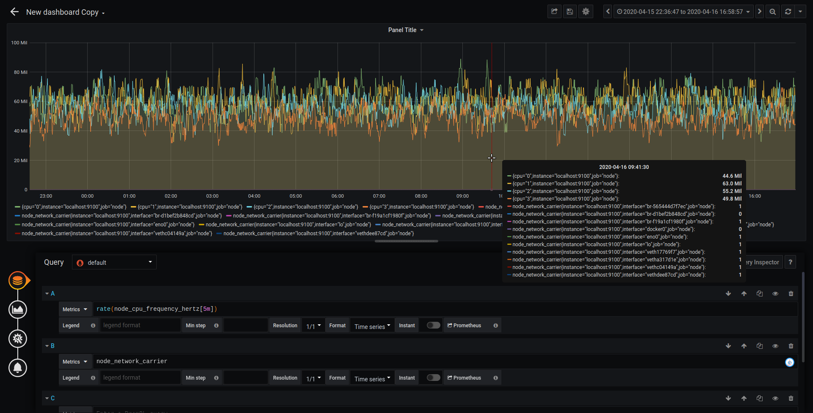
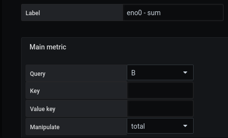

 
# Create modelisation advanced

## Select query

Let's choose those two queries :

- node_cpu_frequency_hertz
- node_network_carrier


See what they return :



node_cpu_frequency_hertz


```
node_cpu_frequency_hertz{cpu="0",instance="localhost:9100",job="node"}
node_cpu_frequency_hertz{cpu="1",instance="localhost:9100",job="node"}
node_cpu_frequency_hertz{cpu="2",instance="localhost:9100",job="node"}
node_cpu_frequency_hertz{cpu="3",instance="localhost:9100",job="node"}

```

node_network_carrier

```

node_network_carrier{instance="localhost:9100",interface="br-565444d7f7ec",job="node"}
node_network_carrier{instance="localhost:9100",interface="br-d1bef2b848cd",job="node"}
node_network_carrier{instance="localhost:9100",interface="br-f19a1cf1980f",job="node"}
node_network_carrier{instance="localhost:9100",interface="docker0",job="node"}
node_network_carrier{instance="localhost:9100",interface="eno0",job="node"}
node_network_carrier{instance="localhost:9100",interface="lo",job="node"}
node_network_carrier{instance="localhost:9100",interface="veth17769f7",job="node"}
node_network_carrier{instance="localhost:9100",interface="vetha317d1e",job="node"}
node_network_carrier{instance="localhost:9100",interface="vethc04149a",job="node"}
node_network_carrier{instance="localhost:9100",interface="vethdee87cd",job="node"}

```

There are a lot of values, so we have to manipulate them in order to come up with a coherent value.

## Create regions and manipulate the Metric

### Step 1 : Import our SVG

Adding a background image is done from the `display` menu.

The selected image will be [demo1-background.svg](../../resource/demo1-background.svg). To do this, we download it in base64 with the `Copy image address` function.

It is possible to have more details with the [display](../editor/display.md) page.

You have to save and reload the page.

### Step 2 : Create the region

We will create two regions

For this step, you can follow the [tutorial2](tutorial2.md) to create your region and add some colors

### Step 3 : Add Main metric to the region and manipulate the data

Once the regions are created, go to Main metric and add the one you want.

Then you can choose between "manipulate the average", if you want an average of the metric values. Or "manipulate the total", if you want a sum of the metric values.




If your measurement is to return only one value, you must select "handling error". 
This will display its value, if it is unique, and will display an error if there are other values.


