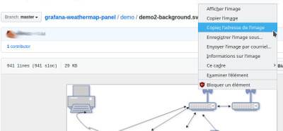

# Display

## Character font

The font list uses the standard fonts that are available in the browser.

You can choose the following font :

- "Helvetica"
- "Arial"
- "sans-serif"
- "mono"

## Size

Choice of text size in `em`.

Example: `1em` to `4em`.

## Style

Differents styles are possible: bold, italic, underlined, etc.

- bold: "True" or "False" to bold the text
- italic: "True" or "False" to italicize the text
- underline: "True" or "False" to put the text underline

## Use SVG

It allows you to download an SVG to be able to manage the regions. By unchecking, you can download any image but it will not be interactive.

## Picture

It is important to define a space to delimit its environment, for this you can download

- If you use SVG
- If you don't use SVG
- Choose an image from your computer
- Base 64

To do this, it is possible to load a background image using one of the methods suggested:

### If you use SVG

#### Vector Image

This is a vector image in SVG format. The creation of the SVG file is described in the dedicated page : [Build an SVG file](../appendix/svg.md)

### If you don't use SVG

#### Bitmap image

It is an image created point by point with a content that is neither dynamic nor vectorial.

It is possible to load a background image in :

- JPG or JPEG
- PNG
- GIF

You must fill in the space required to create your environment

- Width
- Height

to get the following result

#### No background image

You must fill in the space required to create your environment without background image :

- Width (en pixel)
- Height (en pixel)

to get the following result

## Choose an image from your computer

It is possible to load a background image from your computer. It will be loaded once and will be positioned in the background.

It can be in a possible format (SVG / JPG / PNG / GIF)

From the selector, you choose the file of your choice. After confirmation, the image will be displayed and the fields of the editor will be completed to obtain the following result :

## base 64

It is possible to load an image in _base 64_ like this :

to do that, you have to _copy the address of the image_

# See too

- [Tutorial 01 : Add a dashboard SVG](../demo/tutorial01.md)
- [Tutorial 02 : Add a dashboard PNG/JPEG](../demo/tutorial02.md)
- [Tutorial 03 : Create dashboard Avanced with link directionnel](../demo/tutorial03.md)
- [Tutorial 09 : How to create a coordinate mode region](../demo/tutorial09.md)
