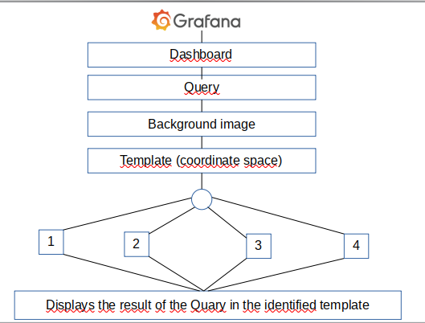

# Introduction

WeatherMap Panel Plugin for Grafana is free software. You can redistribute it and/or modify it under the terms of the GNU General Public License as published by the Free Software Foundation

WeatherMap Panel Plugin is distributed in the hope that it will be useful, but WITHOUT ANY WARRANTY; without even the implied warranty of MERCHANTABILITY or FITNESS FOR A PARTICULAR PURPOSE. See the GNU General Public License for more details.

Parts of this software distribution are by other authors. Please see the README file for attribution and license details.

### Exemple :

Sample output from WeatherMap Panel Plugin

## WeatherMap Panel Plugin

WeatherMap Panel Plugin for Grafana is inspired by the WeatherMap plugin for Cacti.

This plugin is created to map a computer network. This makes it possible to be informed in real time in case a computer system is malfunctioning or other.

It take data from your network devices and use it to provide a single-page overview of the current state of network

We can compare this to the presentation of the weather. 
Indeed, the background with the computer network can represent a country. And we add on this background regions, points and links which can refer to the weather in a given city. 
In addition, it is possible to add values from the network device to each region, point or link, just as you can add the temperature for a city.

Many settings are available to customize the rendering.

### Background

For the background of your map, you can use a vector image or a bitmap image. Vector image allows you to easily use image shapes to add colors or values to the image

### Coordiate Space

On those background, it is possible to create several objects to represent your cumputer network. 
You can add :
- Region
    - If you want to use a vector image shape
    - If you want to put a set of devices together in one block

- Point
    - You can add a point where you want on your background and add a metric, a color or other to it

- Oriented Link
    - Allows you to create a link between two objects by adding a metric to it. This can be useful to represent a data transfer or something else.

### Query

It is also possible to assimilate requests to the Coordination Space, just as we can assimilate the temperature to a city. 
To do so, we use a database that gathers all the necessary data. These data are sorted and collected using queries with filters. 
Once the data has been processed and collected, it can be affected.

### Workflow

Here, we will explain the different step of "How to use WeatherMap Panel Plugin"

Step 1 : Connect you to Grafana and add our plugin by following [This tutoriel](config-data-source.md)

Step 2 : Create a new dashboard

Step 3 : On the `queries` menu, select `Prometheus` and add as many query as you want

Step 4 : On the `visualisation` menu, you will be able to choose your backgound (SVG image, Bitmap image, or no image)

Step 5 : Once you have done that, by going to the editor tabs, you can add some regions, points and link to your dashboard

Step 6 : Then, you can assimilate metrics to the regions/points/links you just created. To do that, there is 3 differents way that we are going to explain to you

#### Method 1

First method :
- You choose a query that return only one value and you want to assimilate the result without adding any filter

#### Method 2

Second method :
- You choose a query that return multiple value with differents key/valueKey, and you want to add a filter to refine your query.

Step 7 : Once you have done all of those step, you will see the result of your query on the dashboard, assimilate with a region/a point or a link.