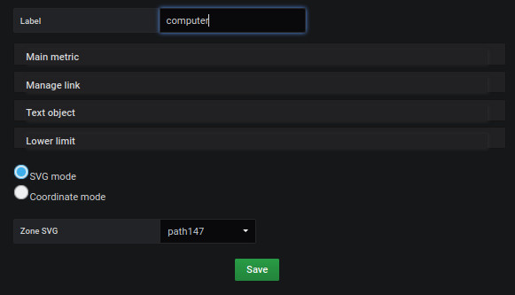
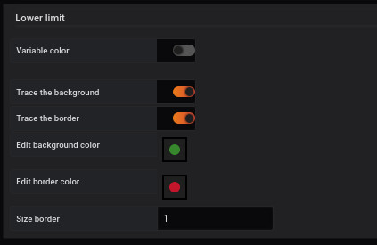
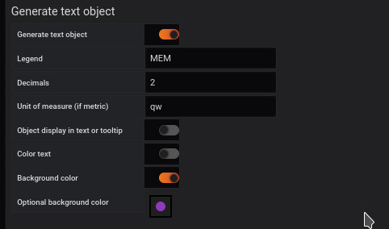
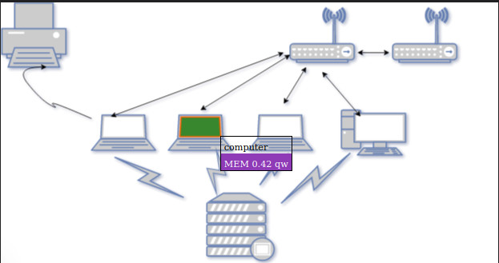
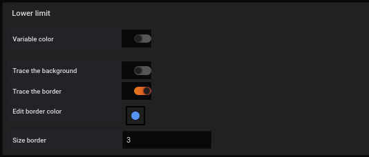
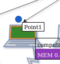
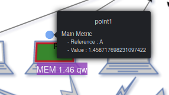
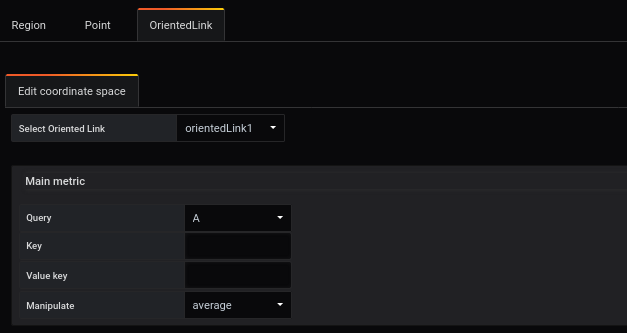
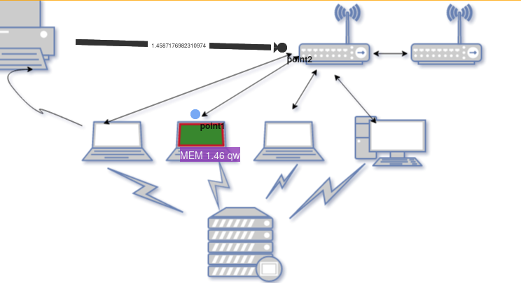

## Ajouter un dashboard SVG
[](README.md)


L'ajout d'une image de fond se fait à partir du menu `display`.


L'image sélectionnée sera [demo1-background.svg](../../resource/demo01-background.svg). Pour ce faire, nous la téléchargeons en base64 avec la fonction `Copier l'adresse de l'image`.


```
https://raw.githubusercontent.com/atosorigin/grafana-weathermap-panel/master/docs/resource/demo01-background.svg

```

Il est possible d'avoir plus de détails avec la page [display](../editor/display.md).

Vous devez sauvegarder et recharger la page.

## Créer une région dynamique


### Etape 1 : Définir une région SVG





La création d'une région dans une image SVG s'effectue à partir du menu `Coordinates space`, `region` et `Àdd coordinate space`

Vous devez remplir le formulaire comme ceci : 

- Saisir un `label` par exemple Computer
- Sélectionner `SVG label`
- Choisir dans la liste déroulante, la ligne `path 147`
- Cliquer sur le bouton `load`


### Etape 2 : Ajouter une couleur à l'élément SVG





L'ajout d'une couleur à un élément SVG s'effectue à partir du menu `Coordinates space`, `region` et `Edit coordinate space`

Vous sélectionnez la ligne `Lower limit` pour compléter le formulaire comme ceci : 
 

- Activer `Trace the background` pour activer la couleur d'arrière-plan 
- Sélectionner la couleur `verte` à la ligne `Edit background color`
- Activer `Trace the border` pour activer la couleur de bordure
- Sélectionner la couleur `rouge` à la ligne `Edit border color`
- Saisir une valeur pour définir la taille de la bordure `size border` par exemple 3
- Cliquer sur le bouton `load`


Vous obtenez le résultat suivant


Il est possible de définir d'autres paramètres, en vous référant à la page [coordinates lower limit](../editor/coordinates-lower-limit.md)


### Etape 3 : Ajouter une Query à un élément SVG


La première étape passe par l'onglet `Queries`

Vous devez :

- compléter la ligne `metrics` avec la ligne suivante

```
rate(go_memstats_gc_cpu_fraction[5m]) * 100000
```

Le point de repère sera `A` qui sera le code utilisé ci-dessous


La deuxième étape s'effectue à partir du menu `Coordinates space`, `region` et `Edit coordinate space` de l'onglet `visualization`

Vous sélectionnez la ligne `Main metric` pour compléter le formulaire comme ceci : 

- Saisir un `Query` par exemple A
- Cliquer sur le bouton `load`


La valeur sera automatiquement affichée après le rafraichissement de la page


Il est possible de définir d'autres paramètres, en se référant à la page [coordinates space region](../editor/coordinates-space-region.md)


### Etape 4 : Mise en forme des informations de l'élément SVG





La mise en forme des informations de l'élément SVG s'effectue à partir du menu `Coordinates space`, `region` et `Edit coordinate space`

Vous sélectionnez la ligne `Text object` pour compléter le formulaire `Generate text object`comme ceci : 

- Saisir une `légende`
- Saisir le nombre de chiffre après la virgule dans `Digital formating` par exemple 2
- Saisir une unité de mesure à la ligne `unit of mesure` comme qw
- Choisir une couleur d'arrière plan
- Choisir une couleur de texte
- Cliquer sur le bouton `load`

### Résultat

Le résultat final sera comme cela : 




## Création d'un point 


### Etape 1 : Placer un point


- Pour placer un point, il faut se rendre dans `Visualization`, puis `Coordinates space`, `Point` et `Add coordinate space`.


Vous devez remplir le formulaire comme ceci : 

- Renseigner le `label` du point
- Renseigner sa `size`
- Saisir la position X et Y ou vous voulez voir le point apparaitre


### Étape 2 : Ajouter une couleur au point





L'ajout d'une couleur à un élément SVG se fait à partir du menu `Coordinates space`, `point` et `Edit coordinate space`.

Vous sélectionnez la ligne `Lower limit` pour compléter le formulaire comme ceci : 
 

- Activer `Trace the background` pour activer la couleur d'arrière-plan 
- Sélectionner la couleur `verte` à la ligne `Edit background color`
- Activer `Trace the border` pour activer la couleur de bordure
- Sélectionner la couleur `rouge` à la ligne `Edit border color`
- Saisir une valeur pour définir la taille de la bordure `size border` par exemple 3
- Cliquer sur le bouton `load`

Vous obtenez le résultat suivant




Il est possible de définir d'autres paramètres, en se référant à la page [coordinates lower limit](../editor/coordinates-lower-limit.md).


### Étape 3 : Ajout d'une requête à un point


Comme nous l'avons vu dans la section précédente, nous avons besoin d'un système de mesure. Vous pouvez donc utiliser la même métrique qu'auparavant, ou vous pouvez donner une autre métrique `B`

Une fois que vous aurez fait cela, vous associerez cette requête à votre point


La deuxième étape se fait à partir du menu `Coordinates space`, `region` et `Edit coordinate space` de l'onglet `visualization`.

Vous sélectionnez la ligne `Main metric` pour remplir le formulaire comme ceci : 

- Entrez une `Query` par exemple A
- Cliquez sur le bouton `load`


La valeur sera automatiquement affichée après le rafraîchissement de la page.


Il est possible de remplir les autres champs avec les paramètres supplémentaires disponibles sur la page [coordinates space region](../editor/coordinates-space-region.md)


### Résultat

Le résultat final sera le suivant : 



## Création d'un lien orienté


### Etape 1 : Placer un lien orienté

Pour créer un lien orienté, vous devez passer par la page [the panel menu](../panel/panel-oriented-link.md).

### Étape 2 : Ajout d'une requête à un lien

Une fois que vous avez placé votre lien sur l'image, vous pouvez aller dans le menu `Coordinates space` and `point` de l'onglet `visualization`.




Ici, vous pouvez voir votre lien `OrientedLink 1`.

Vous sélectionnez la ligne `Main metric` pour remplir le formulaire comme ceci : 

- Entrez une `Query`, par exemple A
- Cliquez sur le bouton `load`


La valeur sera automatiquement affichée après le rafraîchissement de la page.


Il est possible de remplir les autres champs avec les paramètres supplémentaires disponibles sur la page [coordinates space link](../editor/coordinates-space-link.md)


### Résultat final


## Ajoutez tout avec JSON

### Importer un fichier JSON

- Il est possible d'ajouter toutes ces configurations par le biais de fichiers json en faisant une importation. Pour savoir comment faire, [suivez ce lien](../editor/import.md)

Et voici les différents fichiers JSON :

- [demo1-svgRegion](../../resource/demo01-svgRegion.json) 
- [demo1-point](../../resource/demo01-point.json)
- [demo1-link](../../resource/demo01-link.json)
- [demo1-global](../../resource/demo01-global.json)
