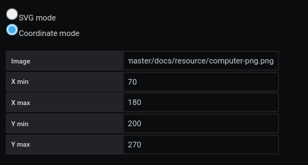
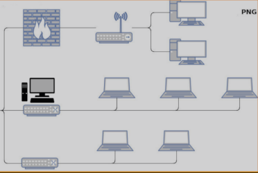
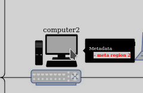
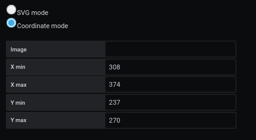
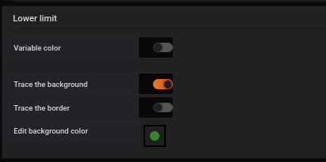
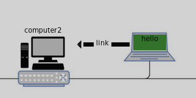
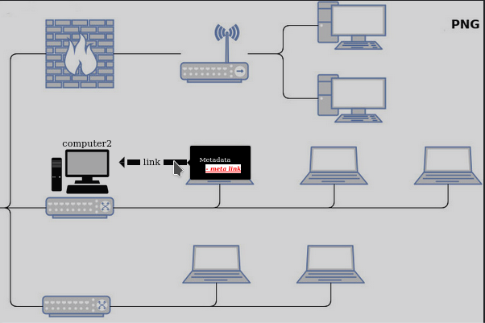

# Ajoutez PNG/JPG dans votre tableau de bord

[](README.md)

## Ajouter une image comme affichage

Pour ce tutoriel, vous devez d'abord télécharger l'image de fond :


L'ajout d'une image de fond se fait à partir du menu `display`.

L'image sélectionnée sera [demo02-background.jpg](../../resource/demo02-background.jpg).

Pour ce faire, nous la téléchargeons en base64 avec la fonction `Copier l'adresse de l'image`, ou avec le lien direct du dépôt :

```
https://raw.githubusercontent.com/atosorigin/grafana-weathermap-panel/master/docs/resource/demo02-background.jpg
```

Il est possible d'avoir plus de détails avec la page [display](../editor/display.md).

## Définir une région en mode coordonnée avec une image

### Ajouter une image dans une région

La création d'une région dans une image SVG se fait à partir du menu `Coordinates space`, `region` puis `Add coordinate space`.


Vous devez remplir le formulaire comme ceci :

- Entrer un `label` par exemple : ordinateur
- Selectionner `Coordinate mode`.
- Puis choisissez une image

Pour finir

- Cliquez sur le bouton `save`

L'image sélectionnée sera [cumputer-png.png](../../resource/computer-png.png). Pour ce faire, nous la téléchargeons en base64 avec la fonction `Copier l'adresse de l'image`.

Definissez ensuite la taille de la région pour votre image. Ici, nous choisirons :

- X Min : 70
- X Max : 180
- Y Min : 200
- Y Max : 270



### Résultat

Le résultat final sera le suivant :



### Metadata

Dans l'éditeur, nous choisissons la ligne `metadata` pour ajouter un message.


Un champ vide est affiché et nous le remplissons avec notre objet `region`. Pour cela, on remplit le champ, puis on clique sur `add`.


Un panneau de configuration est disponible pour configurer l'affichage du résultat.


On choisit :

 - Fond : blanc
 - Texte : Rouge
 - Le style : Gras




Le message sera visible lorsque la souris passera sur l'objet


## Définir une région en mode de coordination sans image

### Étape 1 : Créer la région

La création d'une région dans une image SVG se fait à partir du menu `Coordinates space`, `region` puis `Add coordinate space`.


Vous devez remplir le formulaire comme ceci :

- Entrez un `label` par exemple ordinateur
- Sélectionnez `Coordinate mode`.



Definissez ensuite la taille de la région pour votre image. Ici, nous choisirons :

- X Min : 308
- X Max : 374
- Y Min : 237
- Y Max : 270

Pour finir

- Cliquez sur le bouton `save`

### Étape 2 : Ajouter une couleur à une région



L'ajout d'une couleur à un élément SVG se fait à partir du menu `Coordinates space`, `region` puis `Edit coordinate space`.

Sélectionnez la ligne `lower limit` et remplissez ensuite le formulaire comme ceci :

- Cocher `Trace the background` pour activer la couleur de fond.
- Sélectionnez la couleur `verte` dans la ligne `Editer la couleur de fond`.

Vous obtenez le résultat suivant


Il est possible de définir d'autres paramètres, en se référant à la page [coordinates lower limit](../editor/coordinates-lower-limit.md).

### Résultat

Le résultat final sera le suivant :


## Définir un lien orienté entre deux régions

Pour créer un lien orienté, vous devez passer par [le menu du panneau](../panel/panel-oriented-link.md).

Vous pouvez aussi vous rendre au [tutoriel3](tutorial3.md) qui explique comment faire

## Nouveau résultat




## Add metadata for the link


Dans l'éditeur, nous choisissons la ligne `metadata` pour ajouter un message dans le `orientedLink`.


Un champ vide est affiché et nous le remplissons avec notre objet `link`. Pour cela, on remplit le champ, puis on clique sur `add`.


Un panneau de configuration est disponible pour configurer l'affichage du résultat.


On choisit :

 - Fond : blanc
 - Texte : Rouge
 - Le style : Gras, Italique, Souligné


Le message sera visible lorsque la souris passera sur l'objet


## Résultat final



### Importer un fichier JSON

- Il est possible d'ajouter toutes ces configurations par le biais de fichiers json en faisant une importation. Pour savoir comment faire, [suivez ce lien](../editor/import.md)

Et voici les différents fichiers JSON :

- [demo02-CoorRegion](../../resource/demo02-CoorRegion.json)
- [demo02-link](../../resource/demo02-link.json)
