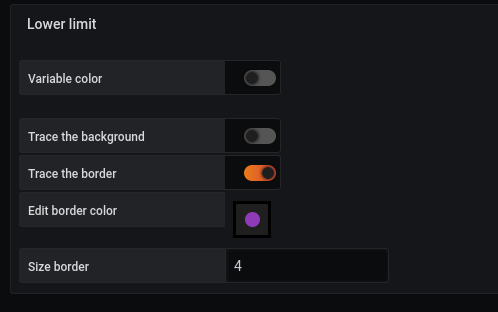

# Comment créer une région en mode coordonnée
[](README.md)

## Ajouter un dashboard SVG


L'ajout d'une image de fond se fait à partir du menu `display`.


L'image sélectionnée sera [demo1-background.svg](../../resource/demo01-background.svg). Pour ce faire, nous la téléchargeons en base64 avec la fonction `Copier l'adresse de l'image`.


```
https://raw.githubusercontent.com/atosorigin/grafana-weathermap-panel/master/docs/resource/demo01-background.svg

```

Il est possible d'avoir plus de détails avec la page [display](../editor/display.md).

Vous devez sauvegarder et recharger la page.

## Ajouter une région avec le mode de coordonnées

Dans cette section, nous allons expliquer comment créer différentes régions sur le dashboard avec le mode de coordonnées.

! [AddCoordiante](../../screenshots/demo/tutorial09/RegionCoordinateMode.png)

Ici, nous pouvons voir une section avec `X min`,`X max`,`Y min`,`Y max`.
Le point de référence est le point (0,0). On peut donc avoir 3 cas différents 

Pour a<b, 

- Si Xmin et Xmax sont négatives :
    - Xmin = b
    - Xmax = a
    - Exemple : 
        - `a=-60` et `b=-20`. 
        - Alors `Xmin=-20` et `Xmax=-60`

- Si Xmin est négative et Xmax est positive :
    - Xmin = a
    - Xmax = b
    - Exemple : 
        - `a=-20` et `b=20`. 
        - Alors `Xmin=-20` et `Xmax=20`

- Si Xmin et Xmax sont positives :
    - Xmin = a
    - Xmax = b
    - Exemple : 
        - `a=20` et `b=60`. 
        - Alors `Xmin=20` et `Xmax=60`

Créons ces trois régions sur le tableau de bord. 
Prenons les mêmes valeurs que X pour Y
Nous aurons donc les données suivantes :

Region 1


Region 2


Region3


## Ajoutez de la couleur à nos régions

Nous ajouterons différentes couleurs à nos régions pour les différencier. Allez à la `LowerLimit` et activez `Trace the border`. Ensuite, choisissez une couleur et une taille pour la frontière



## Résultat

Une fois que vous avez fait cela pour vos trois régions, vous devriez avoir quelque chose comme cela :


### Importer un fichier JSON

- Il est possible d'ajouter toutes ces configurations par le biais de fichiers json en faisant une importation. Pour savoir comment faire, [suivez ce lien](../editor/import.md)

Et voici le fichier JSON :

- [demo9-region](../../resource/demo09-region.json) 
