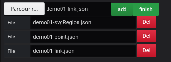
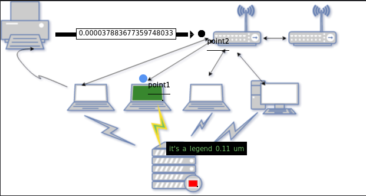

# Construire son dashboard depuis son ordinateur

[](README.md)

Nous vous proposons dans la démonstration 12, la possibilité de créer un journal sans avoir de serveur.

## Ajouter une Query


La première étape passe par l'onglet `Queries`

Vous devez :

- compléter la ligne `metrics` avec la ligne suivante

```
rate(go_memstats_gc_cpu_fraction[5m])
```

Le marqueur "A" sera utilisé pour identifier cette requête

## Ajouter une image de fond


L'ajout d'une image de fond se fait à partir du menu `display`.

Nous choisissons le sélecteur de fichier pour choisir l'image sélectionnée sera [demo01-background.svg](../../resource/demo01-background.svg).

## Importer les fichiers

Pour importer les différents json à partir de votre ordinateur, la sélection s'effectue à partir du menu `import files` et la zone `multi local import`.

### Importer un fichier Région


Pour importer un fichier json Région, vous pouvez utiliser le sélecteur de fichier pour choisir le fichier [demo01-svgRegion.json](../../resource/demo01-svgRegion.json).

Après la confirmation, vous cliquez sur le bouton `add`, suivi de `finish`

Le rendu sera affiché automatiquement avec le fichier chargé.

### Importer un fichier Point


Pour importer un fichier json Région, vous pouvez utiliser le sélecteur de fichier pour choisir le fichier [demo01-point.json](../../resource/demo01-point.json).

Après la confirmation, vous cliquez sur le bouton `add`, suivi de `finish`

Le rendu sera affiché automatiquement avec le fichier chargé.

### Importer un fichier lien



Pour importer un fichier json Région, vous pouvez utiliser le sélecteur de fichier pour choisir le fichier [demo01-link.json](../../resource/demo01-link.json).

Après la confirmation, vous cliquez sur le bouton `add`, suivi de `finish`

Le rendu sera affiché automatiquement avec le fichier chargé.

## Résultat

Le résultat est le suivant


