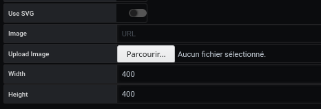

# Gabarit dynamique

[](README.md)

La démo 13 montre comment afficher plusieurs points, provenant de plusieurs demandes, dont 2 points seront liés par un lien.

## Ajouter des requêtes

L'exemple montre comment utiliser des filtres de requête pour obtenir des mesures précises


Dans une requête, nous voulons analyser ce que la carte réseau reçoit

Requête refID A

```
node_network_name_assign_type

```

Le résultat montre plusieurs issues possibles

```
node_network_name_assign_type{device="ens3",instance="localhost:9100",job="node_exporter"}

```

et la requête RefID B

```
node_network_flags
```

Le résultat montre plusieurs issues possibles

```
node_network_flags{device="ens3",instance="localhost:9100",job="node_exporter"}
node_network_flags{device="lo",instance="localhost:9100",job="node_exporter"}

```

pour obtenir un numéro en ce moment, vous devez cocher la case **instant** pour chaque requête

Pour associer des éléments d'interrogation affinés à un modèle, nous nous concentrerons sur le modèle :

- device

qui sera utilisé dans le fichier modèle json de la liste **filtered**

## Etape 2: Déterminer un espace



La création d'un espace d'arrière-plan se fait à partir du menu `display`.

Elle nécessite

- Décocher la case `use svg`.
- Entrez la largeur (ex : 400)
- Entrez la hauteur (ex : 400)

Il est possible d'avoir plus de détails avec la page [display](../editor/display.md).

## Gabarit

Dans l'onglet **Gabarit**


Vous ajoutez le fichier par défaut

```
https://raw.githubusercontent.com/atosorigin/grafana-weathermap-panel/master/docs/resource/demo13-default.json

```

puis 1 clic que le bouton **Add**


vous ajoutez le lien vers le fichier json

```
https://raw.githubusercontent.com/atosorigin/grafana-weathermap-panel/master/docs/resource/demo13-point.json

```

puis 1 clic que le bouton **Add** suivi de **finish**

```
https://raw.githubusercontent.com/atosorigin/grafana-weathermap-panel/master/docs/resource/demo13-point-link.json

```

puis 1 clic que le bouton **Add** suivi de **finish**

le lien sera affiché dans la deuxième partie de l'écran


il doit être interrogé sur

- A pour le premier dossier
- B pour le deuxième dossier


## Resultat


Vous verrez un point apparaître et tous les paramètres seront disponibles dans l'éditeur.

## Structure des fichiers gabarit

le fichier `template` utilisera : 

 - une couleur fixe en limite inférieure
 - plusieurs demandes
 - point et lien
 - Paramètre de position
 - Méta-données
 
 
### default gabarit : demo13-default.json

```
{
  "global": {
     // global
  },
  "default": {
    "templates": [
      {
        // Point
      },
      {
        // Link
      }
    ]
  }
}

```

### Template gabarit : demo13-point.json

```
{
  "global": {
    // global
  },
  "default": {
    "templates": [
      {
        // Point
      }
    ]
  },
  "templates": [
      {
        // Point
      }
   ]
}

```

### Template gabarit : demo13-point-link.json

```
{
  "global": {
    // global
  },
  "default": {
    "templates": [
      {
        // Point
      },
      {
        // Link
      }
    ]
  },
  "templates": [
      {
        // Point
      },
      {
        // second Point
      },
      {
        // Link
      },
   ]
}

```

# Voir aussi

- [Gabarit default](../appendix/gabarit-default.md)
- [Gabarit template](../appendix/gabarit-template.md)
