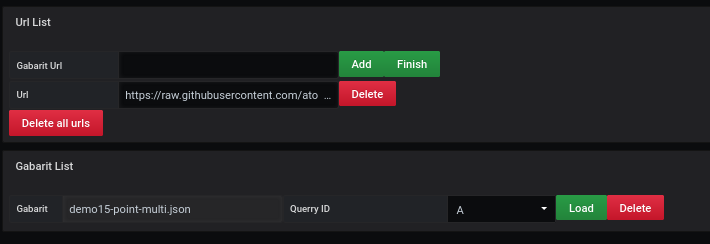
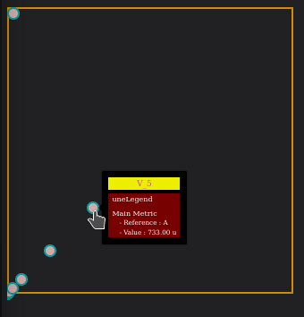

# Chargement multiple de gabarit

[](README.md)

Demo 15 positionne un élément variable dans un espace X et Y, et affiche sa valeur au point défini par un élément dans une requête.

Dans l'exemple, elle affichera un certain nombre de points par rapport au retour de la requête filtrée.


## Ajouter une requête

L'exemple montre comment utiliser des filtres de requête pour obtenir des mesures précises


Dans une requête, nous voulons analyser ce que la carte réseau reçoit

```
prometheus_http_request_duration_seconds_bucket
```

Le résultat montre plusieurs issues possibles

```
prometheus_http_request_duration_seconds_bucket{handler="/api/v1/label/:name/values",instance="localhost:9090",job="prometheus",le="+Inf"}
prometheus_http_request_duration_seconds_bucket{handler="/api/v1/label/:name/values",instance="localhost:9090",job="prometheus",le="0.1"}
prometheus_http_request_duration_seconds_bucket{handler="/api/v1/label/:name/values",instance="localhost:9090",job="prometheus",le="0.2"}
prometheus_http_request_duration_seconds_bucket{handler="/api/v1/label/:name/values",instance="localhost:9090",job="prometheus",le="0.4"}
prometheus_http_request_duration_seconds_bucket{handler="/api/v1/label/:name/values",instance="localhost:9090",job="prometheus",le="1"}
prometheus_http_request_duration_seconds_bucket{handler="/api/v1/label/:name/values",instance="localhost:9090",job="prometheus",le="120"}
prometheus_http_request_duration_seconds_bucket{handler="/api/v1/label/:name/values",instance="localhost:9090",job="prometheus",le="20"}
prometheus_http_request_duration_seconds_bucket{handler="/api/v1/label/:name/values",instance="localhost:9090",job="prometheus",le="3"}
prometheus_http_request_duration_seconds_bucket{handler="/api/v1/label/:name/values",instance="localhost:9090",job="prometheus",le="60"}
prometheus_http_request_duration_seconds_bucket{handler="/api/v1/label/:name/values",instance="localhost:9090",job="prometheus",le="8"}
...
```

Les éléments qui nous intéressent sont :

- handler
- instance
- job
- le


qui sera utilisé dans le fichier modèle json de la liste **filtered**.

nous utiliserons l'élément `le` de la requête qui sera utilisé comme position du point (X, Y) 

## Determining a space


La création d'un espace d'arrière-plan se fait à partir du menu `display`.

Elle nécessite

- Décocher la case `use svg`.
- Entrez la largeur (ex : 400)
- Entrez la hauteur (ex : 400)

Il est possible d'avoir plus de détails avec la page [display](../editor/display.md) page.

## Gabarit avancé

Dans l'onglet **Gabarit**


Vous ajoutez le fichier par défaut

```
https://raw.githubusercontent.com/atosorigin/grafana-weathermap-panel/master/docs/resource/demo15-default.json

```
puis 1 clic que le boutonn **finish**


vous ajoutez le lien du fichier `json` dans l'onglet `url list`.

```
https://raw.githubusercontent.com/atosorigin/grafana-weathermap-panel/master/docs/resource/demo15-point-multi.json

```


puis 1 clic que le bouton **Add** suivi de **finish**.

le lien sera affiché dans la deuxième partie de l'écran



ce fichier doit être associé à une requête

puis 1 clic **load**

## Résultat



## Structure fichier gabarit

le fichier `template` utilisera : 

 - une couleur fixe en limite inférieure
 - la position des points dans X et Y sera variable et définie par le nom de l'élément
 - le résultat de la requête est affiché dans une info-bulle. La valeur apparaît lorsque la souris passe sur le point
 - Paramètre de position

### default gabarit : demo15-default.json

pour le bon fonctionnement de la démo 14, la structure du dossier sera : 

```
{
  "global": {
     // global
  },
  "default": {
    "templates": [
      {
        // Point
      },
      {
        // Link
      },
      {
        // Region
      }
    ]
  }
}

```

### Template gabarit : demo15-point-multi.json

pour le bon fonctionnement de la démo 14, la structure du dossier sera : 

```
{
  "global": {
    // global
  },
  "default": {
    "templates": [
      {
        // Point
      }
    ]
  },
  "templates": [
      {
        // Point
      }
   ]
}

```

# Voir aussi

- [Gabarit default](../appendix/gabarit-default.md)
- [Gabarit template](../appendix/gabarit-template.md)
