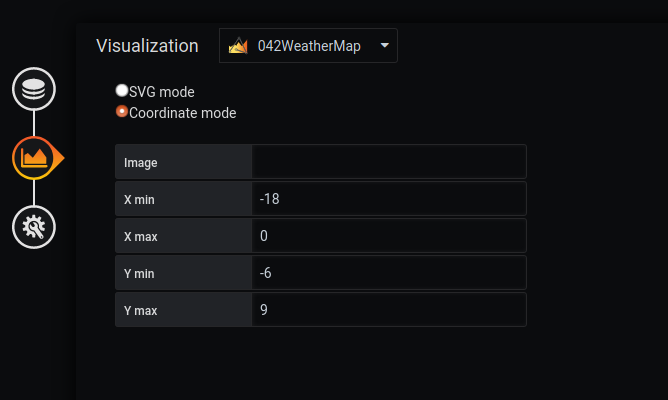
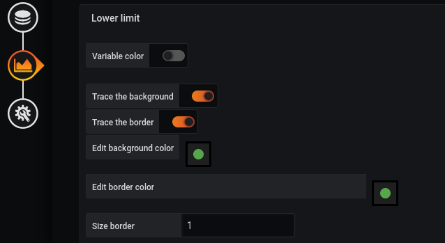
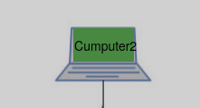

# Ajoutez PNG/JPG dans votre tableau de bord

## Ajouter une image comme affichage
Pour ce tutoriel, vous devez d'abord télécharger l'image de fond : 

! [étape 01](../../screenshots/demo/tutorial2/ImagePNG.png)

L'ajout d'une image de fond se fait à partir du menu `display`.

L'image sélectionnée sera [demo2-background.jpg](../../resource/demo2-background.jpg). Pour ce faire, nous la téléchargeons en base64 avec la fonction `Copier l'adresse de l'image`.

Il est possible d'avoir plus de détails avec la page [display](../editor/display.md).

Vous devez sauvegarder et recharger la page.

## Définir une région en mode coordonnées avec une image

### Ajouter une image dans une région

La création d'une région dans une image SVG se fait à partir du menu `Coordinates space`, `region` puis `Add coordinate space`.

Vous devez remplir le formulaire comme ceci : 

- Entrer un `label` par exemple : ordinateur
- Selectionner `Coordinate mode`.
- Puis choisissez une image

L'image sélectionnée sera [cumputer-png.png](../../resource/computer-png.png). Pour ce faire, nous la téléchargeons en base64 avec la fonction `Copier l'adresse de l'image`.

Deinissez ensuite la taille de la région pour votre image. Ici, nous choisirons :
- X Min : -55
- X Max : -85 
- Y Min : -20
- Y Max : 10

Pour finir
- Cliquez sur le bouton `load`

### Résultat

Le résultat final sera le suivant : 

## Définir une région en mode de coorination sans image

### Étape 1 : Créer la région

La création d'une région dans une image SVG se fait à partir du menu `Coordinates space`, `region` puis `Add coordinate space`.

Vous devez remplir le formulaire comme ceci : 

- Entrez un `label` par exemple  ordinateur
- Sélectionnez `Coordinate mode`.

Deinissez ensuite la taille de la région pour votre image. Ici, nous choisirons :
- X Min : -18
- X Max : 0
- Y Min : -6
- Y Max : 9

Pour finir
- Cliquez sur le bouton `load`

### Étape 2 : Ajouter une couleur à une région

L'ajout d'une couleur à un élément SVG se fait à partir du menu `Coordinates space`, `region` puis `Edit coordinate space`.

Sélectionnez la ligne `lower limit` et remplissez ensuite le formulaire comme ceci : 
 

- Cocher `Trace the background` pour activer la couleur de fond. 
- Sélectionnez la couleur `verte` dans la ligne `Editer la couleur de fond`.
- Cocher `Trace the border` pour activer la couleur de la bordure.
- Sélectionnez la couleur `rouge` dans la ligne `Editer la couleur de la bordure`.
- Entrez une valeur pour définir la taille de la bordure `size border`, par exemple 3
- Cliquez sur le bouton `load`

Vous obtenez le résultat suivant

Il est possible de définir d'autres paramètres, en se référant à la page [coordinates lower limit](../editor/coordinates-lower-limit.md).

### Résultat

Le résultat final sera le suivant : 

## Définir un lien orienté entre deux régions

Pour créer un lien orienté, vous devez passer par [le menu du panneau](../panel/panel-oriented-link.md).

Vous pouvez aussi vous rendre au [tutoriel3](tutorial3.md) qui explique comment faire

## Résultat final 

! [demo2](../../screenshots/demo/tutorial2/demo2.png)

## Ajoutez tout avec JSON

### Importer un fichier JSON

- Il est possible d'ajouter toutes ces configurations par le biais de fichiers json en faisant une importation. Pour savoir comment faire, [suivez ce lien](../editor/import.md)

Et voici le différent dossier JSON :

- [demo2-svgRegion](../../resource/demo2-svgRegion.json) 
- [demo2-point](../../resource/demo2-point.json)
- [demo2-link](../../resource/demo2-link.json)
- [demo2-global](../../resource/demo2-global.json)
