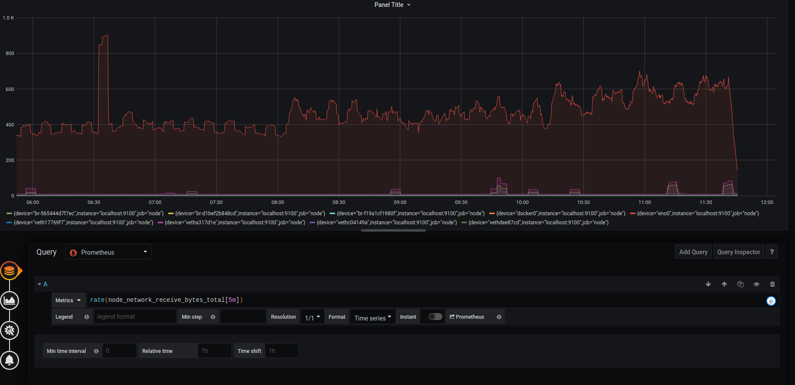
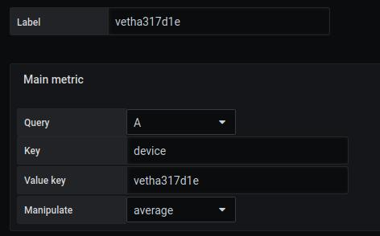
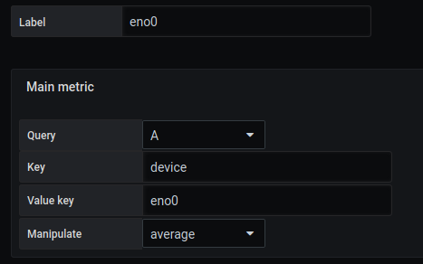
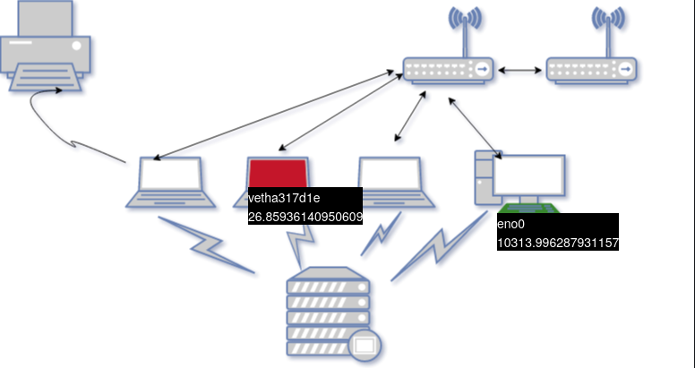

 
# Créer une requête personnalisable

## Ajouter une requête

L'exemple montre comment utiliser des filtres de requête pour obtenir des mesures précises





Dans une requête, nous voulons analyser ce que la carte réseau reçoit


```
rate(node_network_receive_bytes_total[5m])

```


Le résultat montre plusieurs issues possibles


```
node_network_receive_bytes_total{device="br-565444d7f7ec",instance="localhost:9100",job="node"}

node_network_receive_bytes_total{device="br-d1bef2b848cd",instance="localhost:9100",job="node"}

node_network_receive_bytes_total{device="br-f19a1cf1980f",instance="localhost:9100",job="node"}

node_network_receive_bytes_total{device="docker0",instance="localhost:9100",job="node"}

node_network_receive_bytes_total{device="eno0",instance="localhost:9100",job="node"}

node_network_receive_bytes_total{device="veth17769f7",instance="localhost:9100",job="node"}

node_network_receive_bytes_total{device="vetha317d1e",instance="localhost:9100",job="node"}

node_network_receive_bytes_total{device="vethc04149a",instance="localhost:9100",job="node"}

node_network_receive_bytes_total{device="vethdee87cd",instance="localhost:9100",job="node"}

```

La différence montre 9 types d'appareils. Choisissons en 2 pour cet exemple

- vetha317d1e
- eno0


Ici, nous voulons filtrer le résultat pour n'afficher que l'appareil qui nous intéresse.


## Créer des régions et filtrer la métrique

### Etape 1 : Importer notre image PNG

L'ajout d'une image de fond se fait à partir du menu `display`.

L'image sélectionnée sera [demo1-background.svg](../../resource/demo1-background.svg). Pour ce faire, nous la téléchargeons en base64 avec la fonction `copier l'adresse de l'image`.

Il est possible d'avoir plus de détails avec la page [display](../editor/display.md).


```
https://raw.githubusercontent.com/atosorigin/grafana-weathermap-panel/master/docs/resource/demo1-background.svg

```

Vous devez sauvegarder et recharger la page.

### Etape 2 : Créer la région

Nous allons créer deux régions

Pour cette étape, vous pouvez suivre le [tutorial2](tutorial2.md) pour créer votre région et ajouter des couleurs

### Etape 3 : Ajouter la métrique principale à la région et filtrer

Une fois que vous avez créé vos régions, vous pouvez les éditer dans `Region`, `Edit coordinate space`. Cliquez ensuite sur `Main metric` et remplissez le formulaire comme ceci :
- `Query` : Choisissez la requête qui vous intéresse
- `Key` : représente la clé présente dans le résultat de votre requête. Ici, c'est `device`.
- `Value key` : Représente la valeur de la clé précédente. Nous voulons ici filtrer les valeurs `enp0s3` et `lo`.
- `Manipulate` : Vous pouvez choisir si vous voulez un`average`,`sum` ou `total` de la valeur.

Region 1




Region 2



## Result

Le résultat affiche ces 2 valeurs



### Importer un fichier JSON

- Il est possible d'ajouter toutes ces configurations par le biais de fichiers json en faisant une importation. Pour savoir comment faire, [suivez ce lien](../editor/import.md)

Et voici le différent dossier JSON :

- [demo5-region](../../resource/demo5-region.json) 