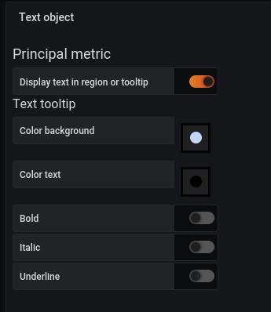
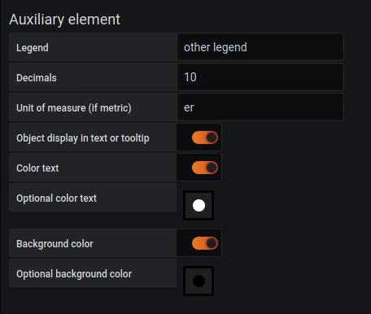

# Text object

Cette partie est commune pour 

- [Region](coordinates-space-region.md)
- [Point](coordinates-space-point.md)
- [Oriented Link](coordinates-space-link.md)

### Principal metric

#### Région

En décochant cette option, le nom du label sera affiché dans la région définie.

Il apparait ensuite plusieurs options pour l'affichage du texte dans la région:

- Color Background : Permet de choisir la couleur du fond
- Color Text : Permet de choisir la couleur du texte
- Text style : Permet de choisir entre une écriture en gras, en italique ou souligné

#### Tooltip

En cochant cette option, le nom du label et le lien "Link tooltip" sera affiché dans l'info bulle qui apparait en passant le curseur sur la région

Il apparait ensuite plusieurs options pour l'affichage du texte dans l'info bulle:

- Color Background : Permet de choisir la couleur du fond
- Color Text : Permet de choisir la couleur du texte
- Text style : Permet de choisir entre une écriture en gras, en italique ou souligné

### Generate texte object

En cochant cette option, vous allez vouloir afficher la valeur de la métrique. Différentes options s'offrent ensuite à vous :

- Legend : Vous permet d'ajouter une légende avant d'afficher la valeur de la métrique.
- Digital formating : Vous permet d'arrondir la valeur de la métrique (A Définir)
- Unit of mesure : Vous permet d'afficher l'unité de la valeur de la métrique
- Object display in text or tooltip : En cochant cette case, la valeur de la métrique s'affichera dans l'info bulle
- Color text : En cochant cette case, vous pourrez choisir une couleur pour le texte de la valeur de la métrique
- Background color : En cochant cette case, vous pourrez choisir une couleur pour le background de la valeur de la métrique

### Auxiliary element

En cochant cette option, vous allez vouloir afficher la valeur de l'auxiliaire définie au préalable. Différentes options s'offrent ensuite à vous :

- Legend : Vous permet d'ajouter une légende avant d'afficher la valeur de la métrique
- Digital formating : Vous permet d'arrondir la valeur de la métrique (A Définir)
- Unit of mesure : Vous permet d'afficher l'unité de la valeur de la métrique
- Object display in text or tooltip : En cochant cette case, la valeur de la métrique s'affichera dans l'info bulle
- Color text : En cochant cette case, vous pourrez choisir une couleur pour le texte de la valeur de la métrique
- Background color : En cochant cette case, vous pourrez choisir une couleur pour le background de la valeur de la métrique

