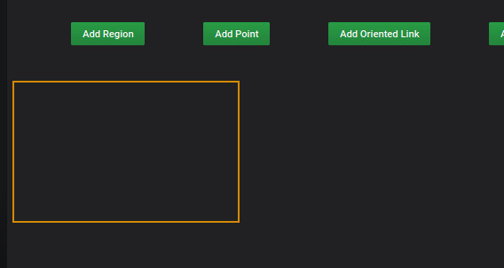

# Display

## Police de caractères

La liste des polices utilise les polices standard qui sont disponibles dans le navigateur.

Vous pouvez choisir la police suivante :

- "Helvetica"
- "Arial"
- "sans-serif"
- "mono"

## Taille

Permet de pouvoir choisir la taille de la police  en `em`

Example: `1em` oo `4em`.

## Style

Différents styles sont possibles : gras, italique, souligné, etc.

- blod : "true" ou "false" pour mettre le texte en gras
- italic : "true" ou "false" pour mettre le texte en italique
- underline : "true" ou "false" pour mettre le texte en évidence
 

## Utiliser SVG

Permet de télécharger un SVG pour pouvoir gérer les régions. En décochant, vous pouvez télécharger n'importe quelle image, mais elle ne sera pas interactive

# Image

Il est important de définir un espace pour délimiter son environnement

Pour cela, il est possible de charger une image en arrière-plan suivant une des méthodes proposées : 

## Si vous utilisez une image SVG

### Image Vectoriel

Il s'agit d'une image vectorielle au format SVG. La création du fichier SVG est décrite dans la page dédiée : [Construire un fichier SVG](../appendix/svg.md)

## Si vous n'utilisez pas une image SVG

### Image Bitmap

Il s'agit d'une image créée point par point dont le contenu n'est dynamique, ni vectoriel

Il est possible de charger une image en arrière-plan au format : 

- JPG ou JPEG
- PNG
- GIF

Il faut renseigner l'espace nécessaire pour créer votre environnement

- Largeur
- Hauteur

pour obtenir le résultat suivant

#### No background image

You must fill in the space required to create your environment without background image :

- Width
- Height

to get the following result

## base 64

Il est possible de charger une image en *base 64* comme ceci : 

pour cela, il faut *copier l'adresse de l'image*

