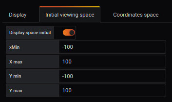

# Initial viewing space

Cette section vous permet de (re)dimensionner votre espace de travail. Il est possible définir 2 méthodes :

## Methode 1

Le défaut référentiel des axes X et Y vont de 0 à 100 %. Si aucune des valeurs est modifié, nous travaillons sur la totalité de la dimension définie dans le display, comme ceci :

La représentation ci-dessus montre l'axe central en position 0 qui sera l'espace initial d'affichage décomposé :

- Position X : Le point en bas à gauche sera la position 0. A partir de l'axe X, une graduation va jusqu'à 100 sur l'horizontal.

- Position Y : Le point en bas à gauche sera la position 0. A partir de l'axe Y, une graduation va jusqu'à 100 sur la hauteur.

## Methode 2

Le découpage se présente comme ci-dessous.

Les axes X et Y vont de -100% à plus 100%. Si aucune des valeurs est modifié, nous travaillons sur la totalité de la dimension définie dans le display, comme ceci :

La représentation ci-dessus montre l'axe central en position 0 qui sera l'espace initial d'affichage décomposé :

- Position X : Le point central est la moitié de la largeur de la dimension de l'espace d'arrière plan, qui donnera la position de l'axe X. A partir de l'axe X centrale, une graduation va jusqu'à 100 sur la droite et -100 sur la gauche.

- Position Y : Le point central est la moitié de la hauteur de la dimension de l'espace d'arrière plan, qui donnera la position de l'axe Y. A partir de l'axe Y centrale, une graduation va jusqu'à 100 sur la droite et -100 sur la gauche.

### Exemple :

Si vous voulez travailler sur la partie supérieure de l'image les caractéristiques seront les suivantes

- X min : -100
- X max : 100
- Y min : 0
- Y max : 100

La partie en rouge sera donc éditable.

