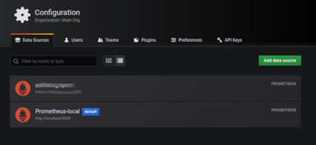
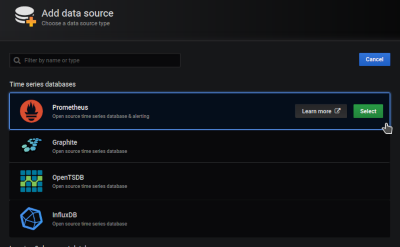

# Configuration data source

## Les données des séries chronologiques comme source de données

Le plugin `grafana-weathermap-panel` peut être utilisé avec toute la base de données utilisée dans Grafana. 

Bases de données supportées :

- Graphite
- InfluxDB
- OpenTSDB
- Prometheus
- MySQL
- Postgres
- MSSQL 
- Elasticsearch

## Exemple d'utilisation avec Prometheus

Vous pouvez utiliser l'interface de Grafana à partir des modules disponibles ci-dessus

### Ajouter la source de données

- Dans la barre latérale de gauche, cliquez sur le bouton `Configuration`
- Cliquez sur le bouton `Add data source` dans l'en-tête supérieur.
- Sélectionnez Prometheus dans la liste déroulante Type.

### Insertion d'une `query` dans un tableau de bord

Pour insérer une requête dans un dashboard, vous devez d'abord créer ce dashboard, puis créer un panel.

- Dans la barre latérale de gauche, cliquez sur le bouton `Create Dashboard`

- Cliquez ensuite sur `Add Query`

- Dans les paramètres du panel, vous devez choisir la requête. Ici, choisissez `Prometheus`.
- Vous pouvez ensuite choisir les Metrics à visualiser

