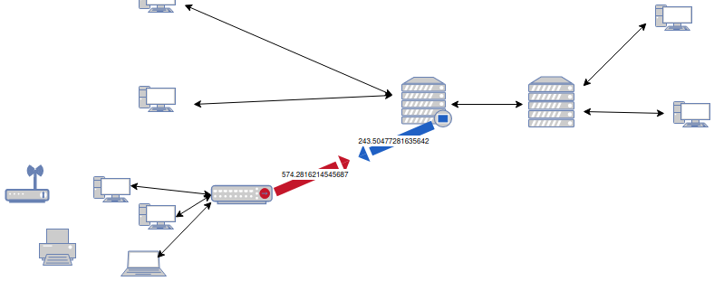
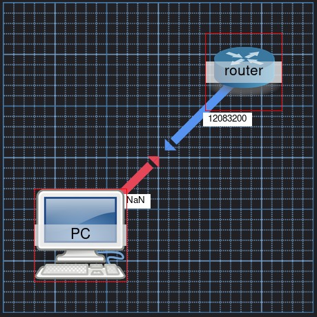

# Introduction

WeatherMap Panel Plugin pour Grafana est un logiciel gratuit. Vous pouvez le redistribuer et/ou le modifier selon les termes de la licence publique générale GNU telle que publiée par la Free Software Foundation

WeatherMap Panel Plugin est distribué dans l'espoir qu'il sera utile, mais SANS AUCUNE GARANTIE ; sans même la garantie implicite de QUALITÉ MARCHANDE ou d'ADAPTATION À UN USAGE PARTICULIER. Voir la licence publique générale GNU pour plus de détails.

Certaines parties de cette distribution de logiciels sont d'autres auteurs. Veuillez consulter le fichier README pour les détails d'attribution et de licence.

### Exemple :

Exemple de sortie de WeatherMap Panel Plugin

## WeatherMap Panel Plugin

WeatherMap Panel Plugin pour Grafana est inspiré du plugin WeatherMap pour Cacti.

Ce plugin est créé pour cartographier un réseau informatique. Cela permet d'être informé en temps réel en cas de dysfonctionnement d'un système informatique ou autre.

Il prend les données de vos périphériques réseau et les utilise pour fournir un aperçu d'une seule page de l'état actuel du réseau.

Nous pouvons comparer cela à la présentation de la météo. 
En effet, l'arriere plan avec le réseau informatique peut représenter un pays. Et on ajoute sur cette arrière plan des regions, des points et des liens ce qui peut faire référence au temmps qu'il fait dans une ville donnée. 
De plus, il est possible d'ajouter des valeurs du péréiphérique réseau à chaque regions, point ou lien, au même titre qu'on peut ajouter la temperature pour une ville.

De nombreux paramètres sont disponibles pour personnaliser le rendu.

### Arrière-plan

Pour le fond de votre carte, vous pouvez utiliser une image vectorielle ou une image bitmap. 

L'image vectorielle vous permet d'utiliser facilement des formes d'image pour ajouter des couleurs ou des valeurs à l'image

### Espace coordonné

Sur ce fond, il est possible de créer plusieurs objets pour représenter votre réseau. 

Vous pouvez ajouter :

- Région
    - Si vous souhaitez utiliser une forme d'image vectorielle
    - Si vous souhaitez rassembler un ensemble d'appareils en un seul bloc

- Point
    - Vous pouvez ajouter un point où vous voulez sur votre fond et y ajouter une métrique, une couleur ou autre

- Lien orienté
    - Permet de créer un lien entre deux objets en y ajoutant une métrique. Cela peut être utile pour représenter un transfert de données ou autre chose.

### Query

Il est également possible d'assimiler les demandes à l'Espace de coordination, tout comme on peut assimiler la température à une ville. 
Pour ce faire, nous utilisons une base de données qui rassemble toutes les données nécessaires. Ces données sont triées et collectées à l'aide de requêtes avec filtres. 
Une fois que les données ont été traitées et collectées, elles peuvent être affectées.

### Workflow

Ici, nous allons expliquer les différentes étapes de "Comment utiliser WeatherMap Panel Plugin".

Etape 1 : Connectez-vous à Grafana et ajoutez notre plugin en suivant [This tutoriel](config-data-source.md)

Étape 2 : Créer un nouveau dashboard

Etape 3 : Dans le menu `queries`, sélectionnez `Prometheus` et ajoutez autant de requêtes que vous le souhaitez

Etape 4 : Dans le menu `visualisation`, vous pourrez choisir votre fond d'écran (image SVG, image Bitmap, ou pas d'image)

Étape 5 : Une fois que vous avez fait cela, en allant dans les onglets de l'éditeur, vous pouvez ajouter des régions, des points et un lien vers votre tableau de bord

Etape 6 : Ensuite, vous pouvez assimiler les mesures aux régions/points/liens que vous venez de créer. Pour ce faire, il y a 3 façons différentes que nous allons vous expliquer

#### Méthode 1

Première méthode :
- Vous choisissez une requête qui ne renvoie qu'une seule valeur et vous voulez assimiler le résultat à une region un point ou un lien, sans ajouter de filtre

#### Méthode 2

Deuxième méthode :
- Vous choisissez une requête qui renvoie plusieurs valeurs avec différentes clés/valeurs, et vous voulez ajouter un filtre pour affiner votre requête.

Étape 7 : Une fois que vous avez effectué toutes ces étapes, vous verrez le résultat de votre requête sur le tableau de bord, assimilé à une région/un point ou un lien.

#### Méthode 3

Prochainement
