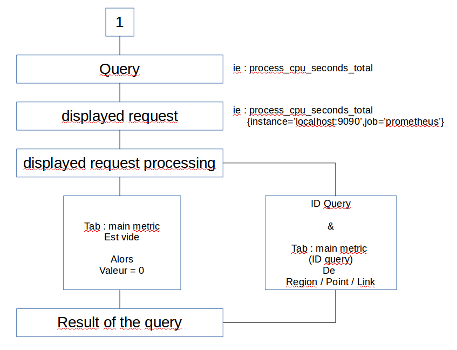
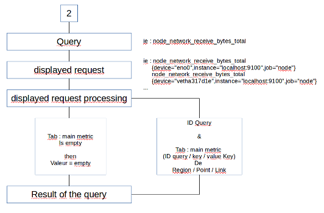
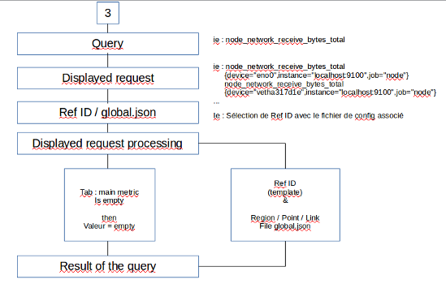
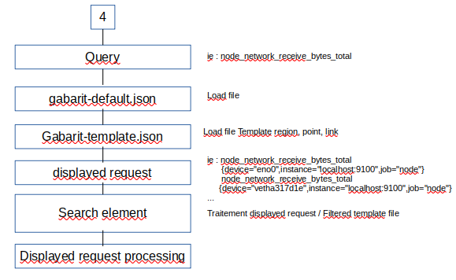

# Flux de travail (workflow)

Ici, nous allons expliquer les différentes étapes de "Comment utiliser WeatherMap Panel Plugin".

Etape 1 : Connectez-vous à Grafana et ajoutez notre plugin en suivant [Ce tutoriel](config-data-source.md)

Étape 2 : Créer un nouveau dashboard

Etape 3 : Dans le menu `queries`, sélectionnez `Prometheus` et ajoutez autant de requêtes que vous le souhaitez

Etape 4 : Dans le menu `visualisation`, vous pourrez choisir votre fond d'écran (image SVG, image Bitmap, ou pas d'image)

Etape 5 : La graduation de l'espace des coordonnées peut être modifiée si vous le souhaitez. Par défaut, la graduation sera celle définie par l'étape précédente.

Le plugin propose plusieurs méthodes pour afficher le résultat de la requête dans le modèle identifié : 

 - Affiche le résultat d'une requête par l'éditeur 
 - Manipuler les éléments d'une requête par l'éditeur
 - Importer des vues prédéfinies pour les requêtes dans l'éditeur
 - Contrôle du rendu par le modèle de requête

#### Méthode 1 : Affiche le résultat d'une requête de l'éditeur

Première méthode :

Pour appliquer cette méthode, vous devez avoir préalablement effectué les étapes 1 à 5.
 
Étape 6 : Une fois que vous avez fait cela, en allant dans les onglets de l'éditeur, vous pouvez ajouter des régions, des points, et un lien vers votre tableau de bord

Etape 7 : Ensuite, vous pouvez assimiler les mesures aux régions/points/liens que vous venez de créer. Pour ce faire, il y a 3 façons différentes que nous allons vous expliquer

Etape 8 : Vous choisissez une requête qui ne renvoie qu'une seule valeur et vous voulez assimiler le résultat sans ajouter de filtre

**Voir aussi**

- [Tutorial 01 : Ajoutez SVG dans votre tableau de bord](../demo/tutorial01.md)
- [Tutorial 02 : Ajoutez PNG/JPG dans votre tableau de bord](../demo/tutorial02.md)
- [Tutorial 03 : Créer un dashboard avancé avec des liens directionnels](../demo/tutorial03.md)
 
 
#### Méthode 2 : Manipuler les éléments d'une requête par l'éditeur

Deuxième méthode :

Pour appliquer cette méthode, vous devez avoir préalablement effectué les étapes 1 à 5.

Étape 6 : Une fois que vous avez fait cela, en allant dans les onglets de l'éditeur, vous pouvez ajouter des régions, des points, et un lien vers votre tableau de bord

Etape 7 : Ensuite, vous pouvez assimiler les mesures aux régions/points/liens que vous venez de créer. Pour ce faire, il y a 3 façons différentes que nous allons vous expliquer

Étape 8 : Vous choisissez une requête qui renvoie plusieurs valeurs avec différentes clés/valeurs, et vous souhaitez ajouter un filtre pour affiner votre requête.

 
**Voir aussi**

- [Tutorial 05 : Créer une requête personnalisable](../demo/tutorial05.md)
- [Tutorial 06 : Créer une modélisation avancée](../demo/tutorial06.md)
 
 
 
#### Method 3 : Importer des vues prédéfinies pour les requêtes dans l'éditeur

Troisième méthode :

Pour appliquer cette méthode, vous devez avoir préalablement effectué les étapes 1 à 5.

Étape 6 : Vous choisissez une requête qui renvoie plusieurs valeurs avec différentes clés/valeurs.

Etape 7 : Ensuite, pour ajouter les différentes régions, points et liens, vous pouvez utiliser un fichier json global. Ce fichier contient toutes les informations nécessaires pour créer et associer chaque objet avec ses métriques

Étape 8 : Une fois que vous avez effectué toutes ces étapes, vous verrez le résultat de votre requête sur le tableau de bord, assimilé à une région/un point, ou un lien.

 
**Voir aussi**

- [Tutorial 10 : Comment ajouter un fichier json global](../demo/tutorial10.md)
- [Tutorial 12 : Construire son dashboard depuis son ordinateur](../demo/tutorial12.md)

#### Method 4 : Contrôle du rendu par le modèle de requête

Quatrième méthode : 

Pour appliquer cette méthode, vous devez avoir préalablement effectué les étapes 1 à 5.

Etape 6 : dans l'onglet `Gabarit`, vous chargez le fichier **par défaut

Etape 7 : Vous chargez le(s) fichier(s) modèle(s) qui sera (seront) composé(s) des différentes formes de rendu 

Etape 8 : A partir des éléments de la requête (requête affinée), il va rechercher les éléments du filtre associé en associant la requête et le fichier

Étape 9 : Une fois que vous avez terminé toutes ces étapes, vous verrez le résultat de votre requête dans le panneau (voir).

**Voir aussi**

- [Tutorial 13 : Gabarit dynamique](../demo/tutorial13.md)
- [Tutorial 14 : Gabarit dynamique avancé](../demo/tutorial14.md)
- [Tutorial 15 : Chargement multiple de gabarit](../demo/tutorial15.md)

