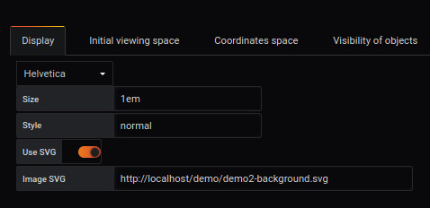
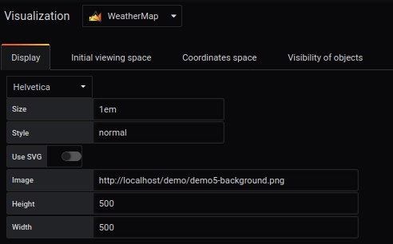
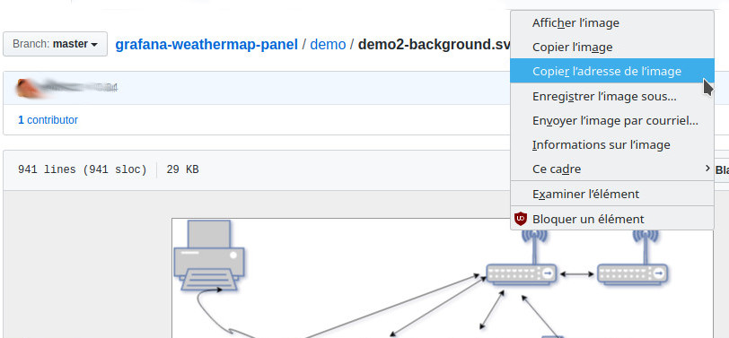

# Display

- Police de caractères

La liste de police de caractères utilise celle standard qui sont disponible dans le navigateur

- size

La taille de la police....

- style

TODO

# Picture

Il est important de définir un espace pour délimier son environnement

Pour cela, il est possible de charger une image en arrière plan suivant une des méthodes proposées : 

## Image Vectoriel

Il s'agit d'une image vectoriel au format SVG. La création du fichier SVG est décrite dans la page dédié : [Construire un fichier SVG](../annex/svg.md)

Après avoir saisie l'url du fichier

Il faut sauvegarder le dashboard, comme ceci

## image Bitmap

Il s'agit d'une image créé point par point dont le contenu n'est dynamique, ni vectoriel

Il est possible de charger une image en arrière plan au format : 

- JPG ou JPEG
- PNG
- GIF

Il faut renseigner l'espace nécessaire pour créer votre environnement

- Largeur
- Hauteur

pour obtenir le résultat suivant

Après avoir saisie l'url du fichier, la largeur et la hauteur

Il faut sauvegarder le dashboard, comme ceci

## base 64

Il est possible de charger une image en *base 64* comme ceci : 

pour cela, il faut *copier l'adresse de l'image*

Après avoir saisie l'url du fichier

Il faut sauvegarder le dashboard, comme ceci

