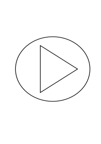
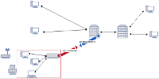

# Resource

The `dashboard` directory offers different examples for the WeatcherMap plugin of grafana.

## Settings

the above demos were made with an associated server. The configuration of this one is explained on the dedicated page : [settings server](../EN/appendix/server.md)

## Demo1

### The Basics

The associated files you can import are =>

  - Picture background SVG => [demo1-background.svg](demo1-background.svg)      
  - Displays a selected element SVG => [demo1-svgRegion.json](demo1-svgRegion.json)
  - Adds links => [demo1-link.json](demo1-link.json)           
  - Adds points => [demo1-point.json](demo1-point.json)            
  - Settings demo1 => [demo1-global.json](demo1-global.json)

To see the tutorial, [follow this link](../EN/demo/tutorial1.md)

## Demo2

### Add PNG/JPG in your dashboard

The associated files you can import are =>

  - Picture background SVG => file [demo2-background.jpg](demo2-background.jpg)       
  - Displays a selected element SVG => [demo2-CoorRegion.json](demo2-CoorRegion.json)
  - Add links => [demo2-link.json](demo2-link.json)  

To see the tutorial, [follow this link](../docs/EN/demo/tutorial2.md)

  
    
## Demo3

### Create Dashboard Avanced with link  directionnel

The associated files you can import are =>

      
  - Add region => [demo3-region.json](demo3-region.json)    
  - Add points => [demo3-point.json](demo3-point.json)            
  - Add links => [demo3-links.json](demo3-links.json)   

To see the tutorial, [follow this link](../docs/EN/demo/tutorial2.md)
  
## Demo4

### How to create and add your own SVG image in Grafana

<!--  -->
To see the tutorial, [follow this link](../docs/EN/demo/tutorial5.md)
  
## Demo5

### Create a customizable query

The associated files you can import are =>

  - Picture background SVG => [demo5-background.svg](demo5-background.svg)           
  - query : rate(go_memstats_alloc_bytes[5m])
  - Displays a selected element SVG and selected region => [demo5-region.json](demo5-region.json)     

To see the tutorial, [follow this link](../docs/EN/demo/tutorial3.md)

  
## Demo6

### Create modelisation advanced

The associated files you can import are =>

  - Picture background SVG => [demo6-background.svg](demo6-background.svg)    
  - Displays a selected element SVG and selected region => [demo6-region.json](demo6-region.json)     
  - query A : node_cpu_frequency_hertz
  - query B : node_network_carrier_changes_total
  
To see the tutorial, [follow this link](../docs/EN/demo/tutorial4.md)

## Demo7
### Create a customizable query avanced

  - Picture background SVG => [demo8-background.svg](demo7-background.svg)    
  - Add link => [demo7-link.json](demo7-link.json)
  - Add SVG region => [demo7-region-svg.json](demo7-region-svg.json)
  - Add coord region => [demo7-region-coord.json](demo7-region-coord.json)

## Demo8
### How to use auxiliere metric

  - Picture background SVG => [demo8-background.svg](demo8-background.svg)    
  - Add points => [demo8-point.json](demo8-point.json)  

## Demo9
### Create link bi directionnel
